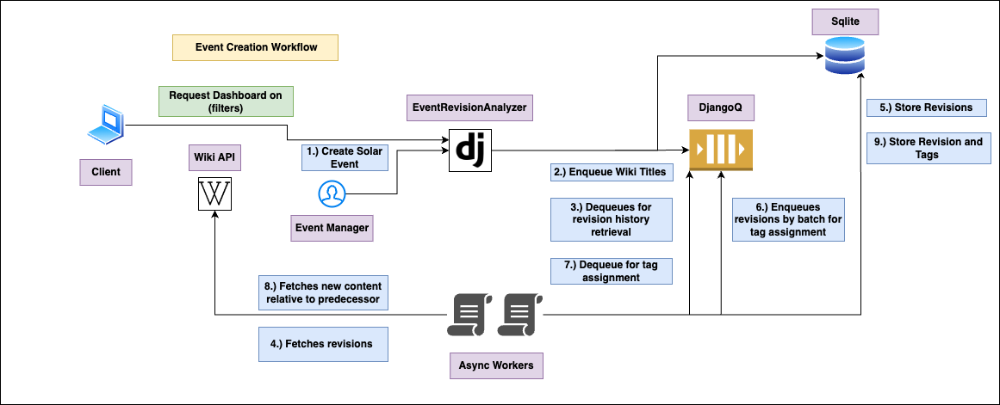

# EventRevisionAnalyzer

Event-Triggered Wikipedia Edits Analyzer for the Solar Industry

## Approach

1. **Revision History Retrieval**: Initially, we use the Wikipedia API to fetch the revision history for a set of Wikipedia titles related to solar events upon the creation of an event. (Note: Revision histories are fetched only at the time of event creation).

2. **Tag Assignment Logic**: After fetching the revisions, tags are assigned based on a variety of factors, including the content of comments, the content added to the revisions, and pre-existing tags within the revisions. The comments are a field within each revision, and we employ an additional API to compare each revision with its predecessor, enabling a detailed analysis beyond merely considering comments and tags. Due to the comparison API requiring approximately 630 milliseconds per call, both the revision fetching and tag assignment processes are made asynchronous using Django-Q to enhance efficiency.

3. **Database Integration**: Both the revisions and their associated tags are integrated into our database, ensuring their storage is organized and they are accessible for further analysis.

4. **User Interface Enhancement**: The user interface displays events along with the count of associated Wikipedia revisions. Users can delve into more details, such as the Wikipedia title and how the tag contributions relate to the total count of revisions for each event.

## Workflow



## Configuration Parameters

- **Parameter:** `host`  
  **Use:** Used by Two Scripts for creating entries for Wiki titles and Events.  
  **Location:** Present in `.env` file.
- **Parameter:** `port`  
  **Use:** Specifies the port number of the server.  
  **Location:** Present in `.env` file. Default value is `8000`.
- **Parameter:** `event_data_path`  
  **Use:** Used by `CreateEventsOfInterest` script to create event entries in the database.  
  **Location:** Present in `.env` file. Points to the `events_data.csv` file, default location is the `doc` folder.
- **Parameter:** `titles`  
  **Use:** Used by `CreateTitlesOfInterest` script to create Wiki title entries.  
  **Location:** Present in `.env` file.
- **Parameter:** `max_day_limit`  
  **Use:** Provides the `RevisionManager` limit to the date range from the event-date.  
  **Location:** Present in `settings.py` file.
- **Parameter:** `workers`  
  **Use:** Provides the number of ASYNC workers you can run in parallel. Workers are responsible for fetching the revision details from the Wiki and assigning tags to the revision.  
  **Location:** Present in `settings.py` inside the `Q_CLUSTER` dictionary.

To ensure a smooth experience with this project, please follow the steps outlined below:

### Initial Setup

1. Install dependencies:

   ```sh
   poetry install
   ```

2. Generate database migrations:

   ```sh
   poetry run python3 manage.py makemigrations
   ```

3. Apply migrations to the database:
   ```sh
   poetry run python3 manage.py migrate
   ```

### Testing

- Before proceeding, run the tests to ensure everything is set up correctly:
  ```sh
  poetry run python3 manage.py test --settings=eventrevisionanalyzer.test_settings tests
  ```

### Running the Application

#### Async Workers with Django-q

- Start the Django-Q cluster:
  ```sh
  poetry run python3 manage.py qcluster
  ```

#### Web Server

- Launch the web server:
  ```sh
  poetry run python3 manage.py runserver
  ```

#### Data Initialization Scripts

- **Wiki Titles**: To store specific Wiki titles, run:

  ```sh
  poetry run python3 CreateTitlesOfInterest.py
  ```

  (Refer to the Configuration Section for customization)

- **Event Data**: To import events from `event_data.csv`, execute:
  ```sh
  poetry run python3 CreateEventsOfInterest.py
  ```
  (Refer to the Configuration Section for customization)

### Access Dashboard

- http://{host}:{port}/event/dashboard
